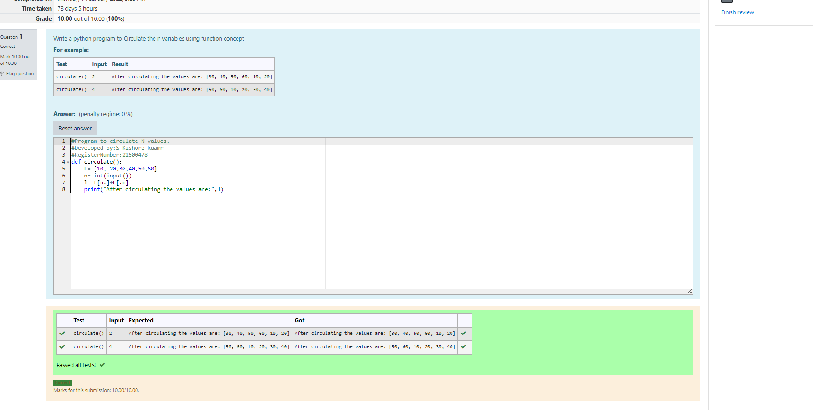

# Circulate-the-values-of-N-variables
## Aim:
To write a python program to circulate the n variables using function concept
## Equipment’s required:
PC
Anaconda - Python 3.7
## Algorithm: 
### Step 1: 
commence the program
### Step 2: 
get the value from the user for the number of rotation
### Step 3: 
Get the value from the user for the number of rotation
### Step 4: 
Using the slicing concept rotate the list

### Step 5: 
print the rotated list
### Step 6: 
end the program
## Program:
```
#Program to circulate N values.
#Developed by:S Kishore kuamr
#RegisterNumber:21500478
def circulate():
    L= [10, 20,30,40,50,60] 
    n= int(input()) 
    l= L[n:]+L[:n] 
    print("After circulating the values are:",l) 
```    
## Output:

## Result:
Thus a python program to circulate the n variables using function concept is succesfully executed